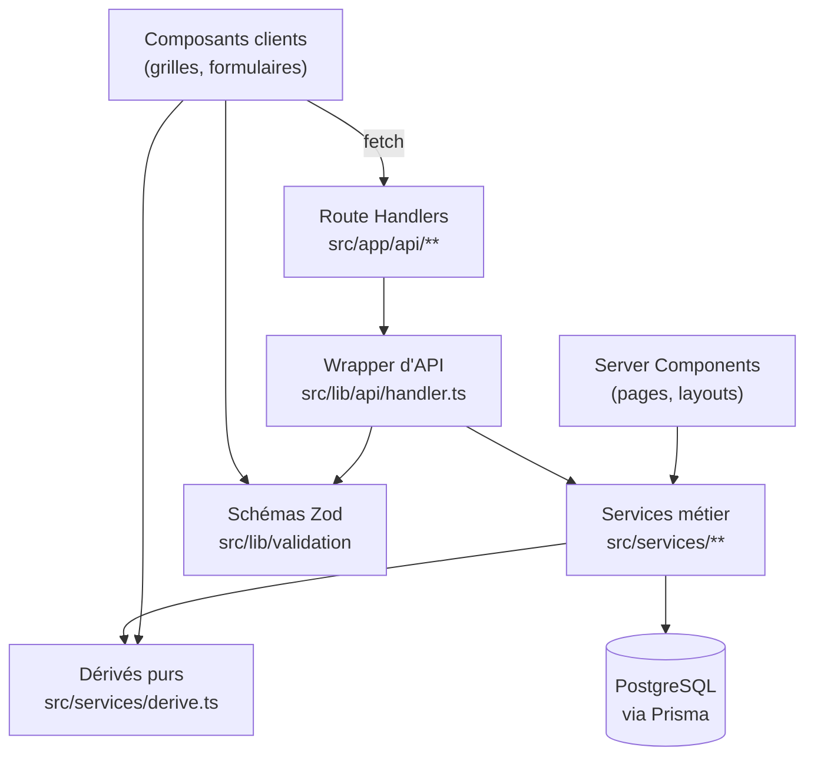

# Architecture du code

Comment le code est organisé, et quel contrat chaque couche doit tenir. Le
**modèle de données** et les **écrans** sont décrits dans le
[`README`](../README.md) ; les **raisons historiques** dans
[`decisions.md`](./decisions.md).

## Les couches et le sens des dépendances



Une seule règle de dépendance : **rien ne remonte**. Un service n'importe jamais
un composant ni un Route Handler ; `derive.ts` n'importe rien du tout.

## `src/services/derive.ts` — le fichier le plus contraint du dépôt

Fonctions **pures**, sans import de Prisma, de React ni du DOM. Cette contrainte
est délibérée : c'est ce qui permet au **navigateur** d'importer exactement les
mêmes fonctions que le **serveur**. Une grille de délibération affiche donc le
total et le statut que la base retiendra, sans réimplémenter une seule règle.

Y vivent : noms complets (latin et arabe), titre de session, totaux, statut
d'admission, résolution du niveau CECRL par intervalle, mois arabes, années
scolaires, formats de matricules, affichage de la date de naissance.

Ajouter une valeur calculée ailleurs qu'ici, c'est créer une divergence en
attente. Voir aussi [`src/services/README.md`](../src/services/README.md).

## Services métier — contrats

| Fichier                   | Contrat                                                                                             |
| ------------------------- | --------------------------------------------------------------------------------------------------- |
| `db.ts`                   | Type `Db` (client **ou** transaction) et `withTransaction`. Tout service accepte l'un comme l'autre |
| `errors.ts`               | Erreurs de service porteuses d'un `code` et d'un `status` — traduites en réponse par le wrapper     |
| `locking.ts`              | `assertSessionWritable` / `assertPositioningTestWritable` : 409 `LOCKED` **avant** toute écriture   |
| `registration-numbers.ts` | Allocation atomique des matricules                                                                  |
| `enrollment.ts`           | Inscription simplifiée, création à la volée, affectation de groupe en masse                         |
| `positioning.ts`          | Résolution des niveaux depuis les notes écrites                                                     |
| `deliberation.ts`         | Calcul de l'admission au seuil de la session                                                        |
| `groups.ts`               | Ouverture et remplissage des groupes de session (par niveau) et d'examen                            |
| `imports.ts`              | Lecture des fichiers, **parsing pur séparé** de l'écriture en base, rapport détaillé                |
| `documents.ts`            | Assemblage des documents officiels, filtres réglementaires inclus                                   |
| `rbac.ts`                 | Droits par ressource et par rôle                                                                    |

Le **parsing** des imports est séparé de leur **application** : la lecture d'un
classeur se teste sans base, ce qui rend les cas tordus (dates ambiguës,
diacritiques arabes, lignes partielles) bon marché à couvrir.

### Allocation des matricules

Le numéro suivant est pris en **une seule instruction** :

```sql
INSERT INTO sequence_counters (scope, value) VALUES ($1, 1)
ON CONFLICT (scope) DO UPDATE SET value = sequence_counters.value + 1
RETURNING value;
```

Un `SELECT` suivi d'un `UPDATE` laisserait deux inscriptions simultanées repartir
du même numéro. `SequenceCounter` est la **seule** table de compteur : ce n'est
pas une valeur dérivée mais un état d'allocation, qui ne peut pas se recalculer
après coup sans risque de réattribuer un matricule déjà imprimé.

Conséquence directe pour toute reprise de données : voir
[`exploitation.md`](./exploitation.md).

## Couche API

`src/lib/api/handler.ts` expose `route()`, qui fait dans l'ordre : résolution de
session, vérification RBAC, exécution, traduction des exceptions. Un Route
Handler ne contient donc ni `try/catch`, ni contrôle de rôle, ni mise en forme
d'erreur.

- `crud.ts` — fabrique de CRUD paramétrée par ressource, typée
  **structurellement** (`CrudDelegate`) plutôt qu'avec `any` : un modèle Prisma
  mal branché échoue à la compilation.
- `pagination.ts` — `orderByFor` **restreint le tri aux colonnes déclarées** par
  ressource ; un `sort` arbitraire venu de l'URL ne peut pas atteindre la base.
- `errors.ts` — `P2002 → 409`, `P2025 → 404`, `P2003 → 409` explicite sur la
  référence. Le client ne voit jamais un message Prisma.

Les statuts et le format de l'enveloppe sont tabulés dans le
[`README`](../README.md#erreurs).

## Authentification

Le provider credentials dépend de bcrypt et du client Prisma, **incompatibles
avec le runtime edge** d'un middleware. La garde vit donc dans le layout `(app)`,
en Server Component. Le middleware subsiste, réduit à exposer le chemin demandé
dans l'en-tête `x-ceil-pathname` : sans lui, la garde ne saurait pas vers quelle
page revenir après connexion, un layout n'ayant pas accès à l'URL.

Les augmentations de type visent `@auth/core/jwt` — `next-auth/jwt` ne fait que
le réexporter, et augmenter un réexport ne compile pas.

## Grilles éditables

`src/components/grid/editable-grid.tsx` fait cohabiter trois mécanismes, chacun
répondant à un défaut mesuré :

1. **État local par cellule**, resynchronisé sur la prop **uniquement hors
   focus**. Pendant la frappe, la valeur remontée au parent est différée d'un
   rendu : la recopier écraserait les caractères déjà saisis.
2. **`startTransition`** pour la remontée au parent : la frappe reste urgente, le
   recalcul de la grille devient interruptible.
3. **Colonnes mémorisées par signature de structure**, pas reconstruites à chaque
   rendu — sinon TanStack remonte les `<input>` et la saisie se perd.

Le collage TSV depuis Excel remplit vers la droite et vers le bas en sautant les
colonnes calculées ; la navigation clavier suit l'ordre naturel du tableau.

## Impression

Les documents sont du HTML mis en page en A4 (`.print-sheet`), avec blocs RTL,
`page-break-inside: avoid` et en-têtes de tableau répétés
(`display: table-header-group`). Ils passent par le groupe de routes `(print)`,
**authentifié comme le reste** : un document officiel ne s'ouvre pas sans session.

## Internationalisation

La locale est portée par le cookie `NEXT_LOCALE`, jamais par un segment d'URL :
aucune duplication des routes sous `[locale]`. `<html>` reçoit `lang` et `dir`
en conséquence.

## Tests

| Emplacement          | Nature                                                                           |
| -------------------- | -------------------------------------------------------------------------------- |
| `tests/services/`    | Purs, sans base — dérivés, imports, pagination, RBAC                             |
| `tests/integration/` | Sur une vraie base `ceil_test` — contraintes, transactions, API                  |
| `e2e/`               | Playwright, en série : le cycle métier complet compte plus que les gestes isolés |

Les suites d'intégration sont **ignorées** si aucune base n'est joignable : un
« tout vert » sans base ne prouve rien, vérifier le nombre de tests exécutés.
